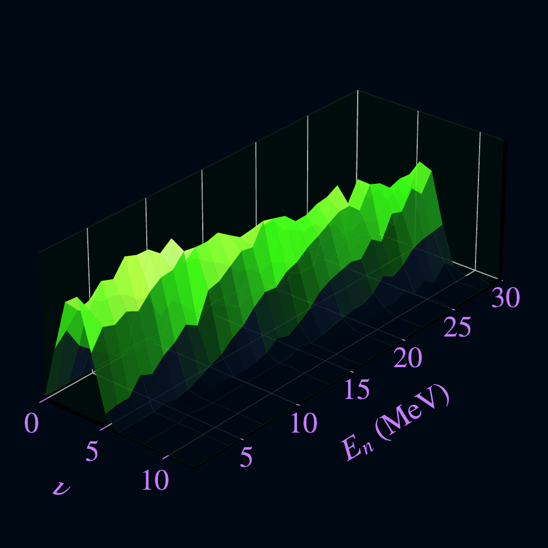

# NUSCONE

Neutron multiplicity analysis for SCONE

<p align="center">
  
</p>

# Installation

```bash
git clone https://github.com/username/NUSCONE.git
cd NUSCONE
python3 -m venv .venv
source .venv/bin/activate
pip install -e ".[dev]"
```

# Running

```bash
nuscone -c configs/u238_default.yaml --plots
```

# Objectives

NUSCONE was developed to extract prompt-fission neutron multiplicity distributions from SCONE data and to infer multi-chance fission probabilities.

The analysis is performed in three successive steps:

1. Reconstruction of the neutron-multiplicity distributions $p(\nu)$ 
2. Calculation of neutron-multiplicity moments ($\bar{\nu}$, $\sigma$, $f_2$, $f_3$)
3. Extraction of first-, second-, and third-chance fission probabilities
4. Calculation of the effective excitation energy of the compound system


## 1. Reconstruction of neutron-multiplicity distributions

For each incident neutron energy bin, SCONE measures an experimental multiplicity distribution $Y(\nu)$, where $\nu$ is the number of detected neutrons. The measurement differs from the true distribution $p(\nu)$ due to the SCONE efficiency $\varepsilon$ and the background during the experiment. The SCONE response is modelled by a binomial response matrix, $R$, while the background is encoded in a matrix $B$. The true multiplicity distribution vector $X$ is therefore extracted from $X=AY$, where $A=RB$.


Direct inversion of the response matrix is unstable because the problem is ill-conditioned. Instead, NUSCONE relies on a Tikhonov regularization to extract the neutron multiplicity distributions with controlled errors and bias [1].

For every incident neutron energy, NUSCONE produces the unfolded multiplicity distributions $p(\nu)$, as a function of the incident neutron energy, partly lotted in _/results/fig_ and saved as CSV files in _/results/tables/_.

## 2. Extraction of neutron-multiplicity moments

Several observables are derived from $p(\nu)$ as a function of the incident neutron energy, such as the average neutron-multiplicity $\bar\nu$, the standard-deviation $\sigma$, and the factorial moments $f_2$ and $f_3$. These observables are also plotted in _/results/fig_ and saved as CSV files in _/results/tables/_.

## 3. Extraction of multi-chance fission probabilities

Above the neutron separation energy, fission may occur after one or several pre-fission neutron emissions. Those processes are called multi-chance fission [1]. As a results, the neutron-multiplicity distribution can be written as

$$p(\nu,E)=x_1(E)\,p_1(\nu,E)+x_2(E)\,p_2(\nu,E)+x_3(E)\,p_3(\nu,E) + ... $$

where $x_1+x_2+x_3+...=1$ denote the multi-chance fission probabilities. So as to extract those ratios, NUSCONE approximates the individual distributions $p_i$ by a Gaussian form for which centroids and widths are parameterized using linear functions of excitation energy [1].

A global minimization is performed simultaneously over all incident neutron energies, adjusting the multi-chance fission probabilities $x_i$, as well as the linear laws describing $\bar\nu$ and $\sigma$ for each intermediate fissioning systems, so as to reproduce the experimental $p(\nu)$ for each energy.

The quality of the extracted probabilities is verified through several independent checks: 
- fair reproduction of global $p(\nu)$,
- fair reproduction of global $\bar\nu$,
- fair reproduction of global standard-deviation $\sigma$.

Uncertainties are quantified through a bootstrap method.

Multi-chance fission probabilities, $x_1$, $x_2$, and $x_3$, are plotted in _/results/fig_ and saved as CSV files in _/results/tables_.

# Bibliography

[1] B. Fraïsse, G. Bélier, _et al_., Phys. Rev. C **108**, 014610 (2023) 

# Contact

fraisse@cua.edu